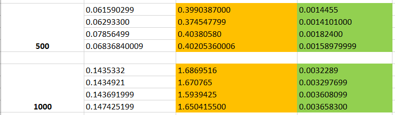

Висновок:
Для вибірок з кількістю чисел до 50 найшвидше відбувається сортуванням за допомогою "Insertion sort". Timsort найшвидше працює на великах вибірках чисел, що більше за 50. При дослідженні вибірки з 50 чисел згаданий метод показував як найшвидший, так і найбільш повільний результат, а на малих вибірках час сортування ним значно нижче за інші досліджені методи. Сортування вставками вказує на середній час виконання, який більше наближений до Insertion sort.